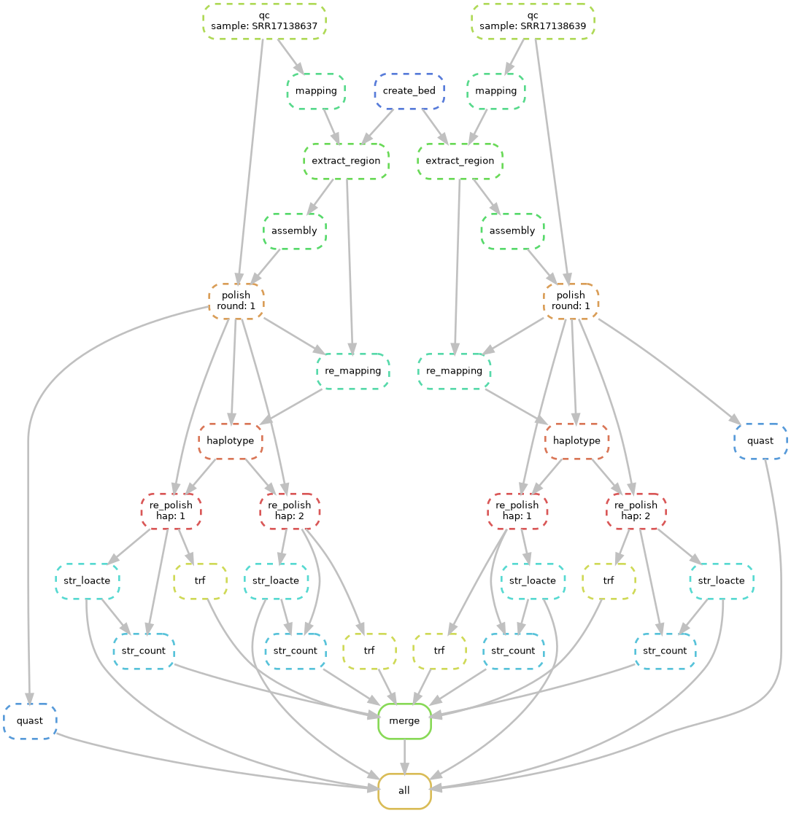
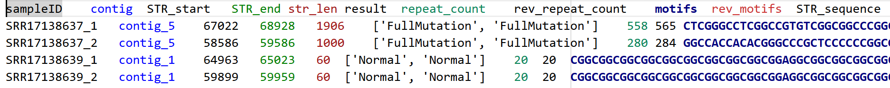
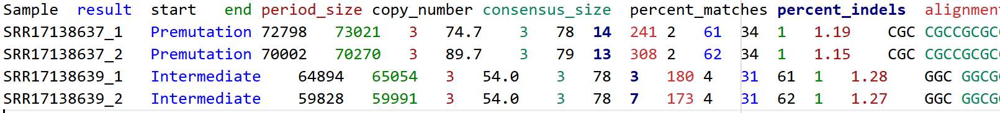

# FMR1_STR pipeline

- update at     2025-08-18 
- author        Hu Qiaoli 
- version       0.1

## 1. Introduction
The **FMR1_STR pipeline** is designed to analyze **FMR1 gene 5’UTR CGG repeat expansions** which are associated with **Fragile X Syndrome(FXS)** using **Nanopore Technology long reads**.  

The pipeline integrates **quality control, mapping, target region extraction and de novo assembly, phasing of haplotype, STR repeat counting and Summary report generation**.  This allows for accurate detection of repeat length, motif interruptions, and allele-specific haplotypes.  

**Pipeline repository:**
```bash
git clone https://github.com/ivyhulife/FMR1_STR.git
```

## 2. Requirements

We recommend running this pipeline inside a **docker** or **Apptainer** container for full reproducibility. The pre-built Docker image includes the following tools:
| Tool          | Version      | Purpose                                    |
| ------------- | ------------ | ------------------------------------------ |
| **NanoPlot**  | 1.32.0       | QC visualization of Nanopore reads         |
| **filtlong**  | 0.2.1       | Filtering of Nanopore reads                |
| **minimap2**  | 2.30-r1287    | Long-read mapping                          |
| **samtools**  | 1.21        | Alignment manipulation                     |
| **bedtools**  | 2.31.1      | Read extraction from genomic regions       |
| **racon**     | 1.5.0       | Contig polishing                           |
| **flye**      | 2.9.3-b1797 | De novo assembly of STR region             |
| **longshot**  | 1.0.0       | SNV-based haplotype phasing                |
| **quast**     | 5.3.0         | Assembly quality assessment                |
| **trf**       | 4.09        | Locate and display tandem repeats in seq    |
| **Python3**   | 3.10.16      | Workflow scripts (numpy, pandas, argparse,pysam,biopython) |
| **snakemake** | 7.32.4        | Workflow management                        |

## 3. Script Directory Structure
```
FMR1_STR/
├── config.yaml                 # Global configuration for Snakemake
├── Dockerfile                  # Docker image definition
├── lib/                        
│   ├── fmr1_flanks.fa          # Flanking sequences for STR localization
│   ├── hg38_chrXY.*            # Reference (hg38 chromosome X subset)
├── ReadMe.md                   # Project documentation
├── snakefile                   # Snakemake pipeline definition
├── src
│   ├── STR.py                  # python script for STR repeat detection and count
│   └── TRF.py                  # python script for Tandem Repeat Finder (TRF) software results
├── str_result.png              # The str results of demo reads
├── trf_result.png              # The trf results of demo reads
└── workflow.png                # Workflow schematic
```

## 4. Usage
### 4.1. Edit **config.yaml** before running the pipeline:
```yaml
samples:  ["SRR17138637","SRR17138639"]   # List of sample IDs
in_path: "./raw_data/"            # Directory containing input FASTQ files
out_path: "./results/"            # Output directory     
src_path: "./src/"                # python script directory     

threads:
  normal: 16                      #  recommended for small or lightweight steps
  high: 60                        # recommended for computationally intensive step
```
### 4.2. Running the Pipeline via snakemeke :
```
snakemake -np                   ## Dry-run (no execution, check DAG)
snakemake -j ${core_num} -p     ## Full execution

# Run inside Docker
docker build -t fmr1_str:latest .
docker run -itv $(pwd):/data fmr1_str:latest  snakemake -np 
docker run -itv $(pwd):/data fmr1_str:latest  snakemake -j ${core_num} -p 
```
### 4.3. Workflow



## 5. Output 
### 5.1 Output Directory Structure
```
./output/
├── 01.QC/             # QC reports for raw and filtered reads
├── 02.Mapping/        # Reads mapped to reference (hg38 subset)
├── 03.Target/         # Extracted reads covering the FMR1 locus
├── 04.Assembly/       # De novo assembly of STR region
├── 05.Cor/            # Polished contig
├── 06.Alle/           # Haplotype-specific contigs after phasing
├── 07.TRF             # Tandem Repeat Finder (TRF) results
├── 08.Summary/        # STR size, motif structure, summary statistics
└── FMR1.bed           # STR locus coordinates
```
### 5.2. Summary report of FMR1 STR CGG using homemade Python scripts 

---
---
### 5.3 Summary report of FMR1 STR CGG using Tandem Repeat Finder (TRF) software


## 6. Notes
- Always run the pipeline inside Docker/Apptainer for reproducibility.

- The workflow is modular: each step can be executed independently by specifying the rule name in Snakemake.

- Multi-sample runs can be managed by Snakemake batch mode.